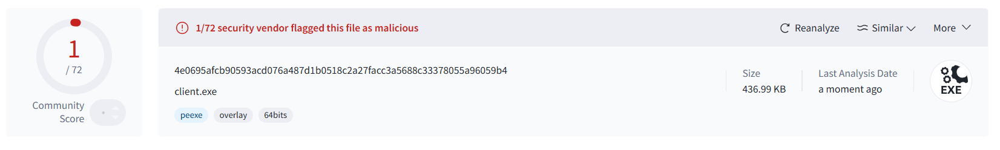

# Janus - C++ Reverse Shell


## Introduction

Janus is a simple reverse shell developed in C++ that can establish a reverse tcp connection
to the attacker from the victim's computer. The attacker can after that execute commands on the victim's computer.
Janus has the objective to be fud (fully undetectable) in the future, it has currently a low detection rate on virustotal.

**Warning**: Janus is for now only compatible with Windows OS. To build it and use it, you need a C++ compiler and CMake installed on your Windows system.

## Features

Janus currently implements the following features:
- Clone on the victim's computer in the `AppData` folder
- Remote command execution via reverse TCP
- Background launch
- Persistence : the backdoor start at every startup of the victims computer

## Installation & build (from source)

To build Janus from source, at first clone the repo and navigate to the directory:
``` bash
git clone https://github.com/Omikrone/Janus.git
cd Janus
```

Once in the directory, you have to compile the project with CMake. But before that, you may want to change 
the host ip and the port used by the backdoor. To do that, simply edit the first lines of ``client.cpp`` and 
``server.cpp`` so it uses your preferences instead of ``localhost``. Once done, you can compile the project with: 
```
mkdir build
cd build
cmake ..
cmake --build .
```

## Usage

Once the project is built, you should have two executables in the ``build`` directory: ``client`` and ``server``.
You can then upload the ``client`` executable to the victim's computer and launch it. On your own computer, you have to launch the ``server`` executable to listen for incoming connections.

## AV detection

Here is the current detection rate on virustotal for Janus:

I will try to get it fud for the next update.

## Disclaimer and further information

This program is for educational purposes only! I take no responsibility or liability for own personal use.